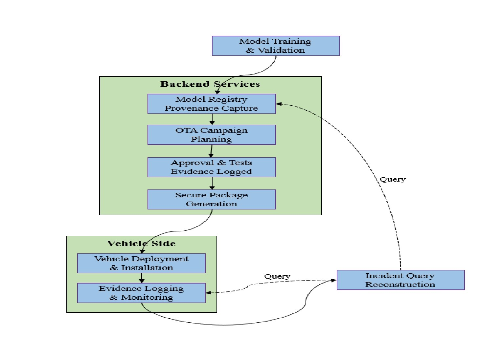
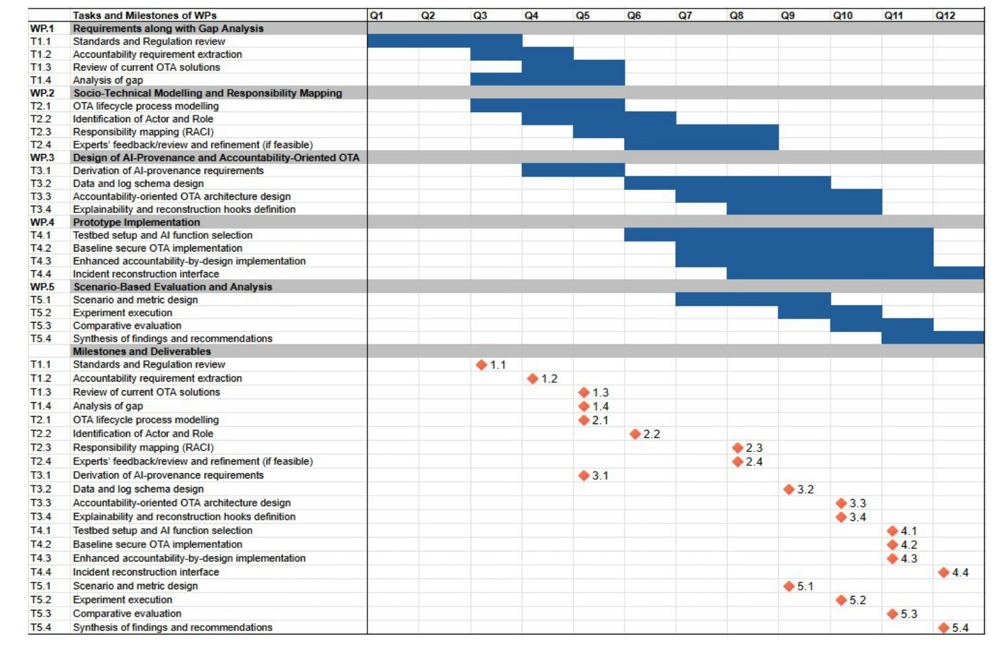

# Accountability-by-Design OTA for AI-Enabled Safety-Critical Vehicle Functions

**University of Surrey | MSc Artificial Intelligence**

---

## Overview

This repository contains a collaborative research proposal investigating how **accountability-by-design** principles can be integrated into Over-the-Air (OTA) software update architectures for AI-enabled safety-critical vehicle systems.

The work focuses on AI model provenance, lifecycle traceability, explainability, evidence logging and incident reconstruction to improve transparency, regulatory compliance and trust in autonomous and connected vehicles.

---

## Research Motivation

Current OTA software update systems primarily focus on cybersecurity and software deployment. However, as AI models become integral to safety-critical vehicle functions, there is an increasing need for mechanisms that support:

- AI accountability
- Model provenance
- Decision traceability
- Explainability
- Incident reconstruction
- Regulatory compliance

This proposal investigates an accountability-oriented OTA architecture to address these challenges.

---

## Research Objectives

- Analyse limitations of current OTA architectures.
- Investigate AI model provenance and lifecycle traceability.
- Study AI accountability in safety-critical systems.
- Design an accountability-oriented OTA architecture.
- Develop a conceptual framework for incident reconstruction.

---

## Research Areas

- Artificial Intelligence
- Trustworthy AI
- Explainable AI (XAI)
- Autonomous Vehicles
- Intelligent Transportation Systems
- Automotive Cybersecurity
- Digital Engineering
- AI Governance
- Over-the-Air Software Updates

---

## Standards and Regulations Studied

- UNECE R155
- UNECE R156
- ISO 24089
- ISO 26262
- ISO 21434
- ISO/PAS 8800

---

## Proposed Methodology

The research proposal follows five work packages:

1. Requirements & Gap Analysis
2. Socio-Technical Modelling
3. Accountability-Oriented OTA Architecture Design
4. Prototype Planning
5. Scenario-Based Evaluation & Analysis

---

## Proposed OTA Architecture

The proposed architecture introduces AI model provenance, evidence logging, explainability hooks and incident reconstruction into the OTA update lifecycle.

---

## Research Work Plan

The proposed timeline organises the research into five work packages covering requirements analysis, architecture design, implementation planning and evaluation.

---

## My Contribution

This was a **collaborative University of Surrey research proposal**.

My primary contributions included:

- Academic Relevance and Impact
- Literature Review
- AI Accountability Analysis
- Trustworthy AI Discussion
- Research Writing and Editing

---

## Repository Contents

- Research Proposal
- Research Methodology
- OTA Architecture
- Research Work Plan

---

## Research Status

**Research Proposal (Concept Stage)**

This repository contains the research proposal only. No implementation or prototype is included.

---

## Author

**Anil Emanuel**

MSc Artificial Intelligence

University of Surrey
